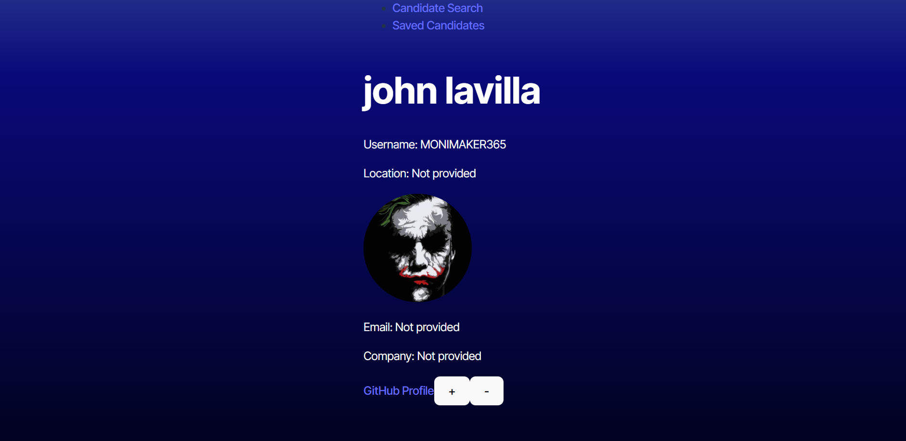
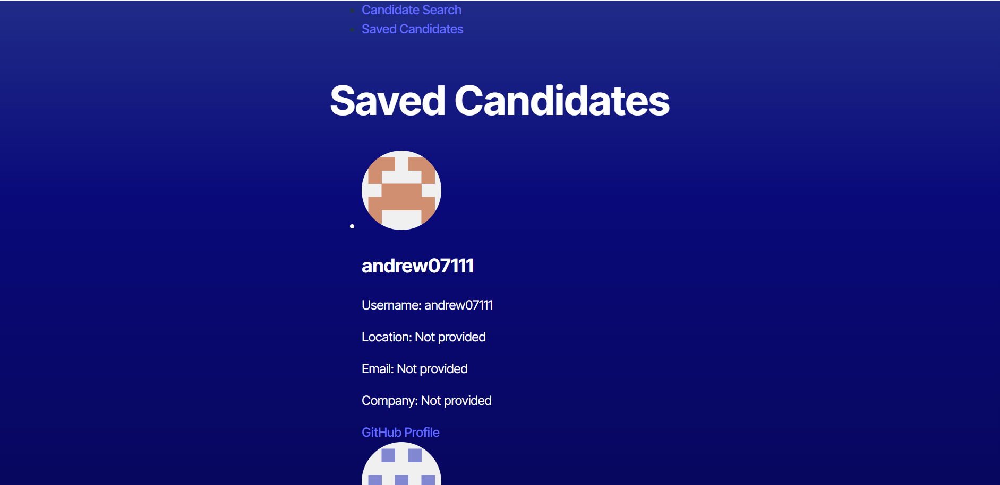

# Candidate Search Application

## Description

The **Candidate Search Application** allows employers to search for potential candidates on GitHub. The application fetches a list of candidates from the GitHub API, displays relevant details (such as name, username, avatar, location, email, and company), and allows users to save candidates to a list of potential hires. Users can view their saved candidates, which persist across sessions using `localStorage`. The app features a simple and intuitive interface for browsing candidates and managing the list of potential hires.

### Key Features:
- Search and view GitHub users as potential candidates.
- Save candidates to a list of potential hires.
- View a list of saved candidates with their details.
- Use `localStorage` to persist saved candidates.
- View candidate information including name, username, location, avatar, email, company, and GitHub profile link.

## Screenshot





## Technologies Used

- **React**: For building the front-end UI.
- **React Router**: For routing between pages.
- **GitHub API**: For fetching user data.
- **LocalStorage**: For persisting saved candidates.
- **CSS**: For styling the components.

## Installation

To run the project locally:

1. Clone this repository:
   ```bash
   git clone https://github.com/qdub10/Project-13.git

2. Install dependencies:
    ```bash
    cd candidate-search
    npm install

3. Create a .env file in the root of the project with your GitHub Personal Access Token:
    ```bash
    VITE_GITHUB_TOKEN=your_personal_access_token_here

4. Start the development server:
    ```bash
    npm run dev


## Usage

1. On the Candidate Search page, you will see a list of potential candidates fetched from the GitHub API. Click the "+" button to save a candidate to your list of potential hires.

2. Navigate to the Saved Candidates page to view the list of candidates you have saved.

3. The saved candidates persist across sessions using localStorage.


## Deployed Application

You can view the deployed application at the following link:


